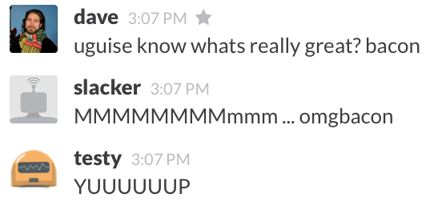

#Slacker Plugins

Typically, chatbots are expected to respond to commands and conversation
happening in the chatroom. The usual arrangement is that you create a *plug-in*
that specifies a regular expression for the bot to trigger on, and how you want
the bot to respond.  Since Slacker is a chatops bot, there are a few other
types of plugins you can define besides the listen/respond kind. The classical
listen/respond behavior, for example, is implemented in Slacker by a [Message
Handler](handlers.md) plugin. 

Here are the four classes of plugins you can currently configure with a Slacker bot:

 * [Handlers](handlers.md) respond to events recieved from Slack's API. Slack
has [quite a few event types](https://api.slack.com/rtm), including things like
messages (people saying things to each other) as well as other things like
notifications of new channels and private rooms being created, people joining
and leaving things, and even notifications of things like people have begun to
type. You can create handlers to enable your slackerbot to respond to all of
these types of events.

 * [Chores](chores.md) allow you to tell the bot to do things on a periodic
schedule. If you wanted Slacker to, for example grab the RSS feed from
http://lobste.rs every hour and parse it for new articles, you could implement a
Chore to do this using crontab syntax. 

 * [Filters](filters.md) enable you to rewrite events as they come in, or go
out to Slack. If it was, for example, Snoop doggy-dog's birthday, and you wanted everything
Slacker said on that day to be translated into
[gangsta](http://www.gizoogle.net/textilizer.php) you could implement an
OuputFilter to do this and your filter would rewrite all out-bound message
traffic. You could also use filters to do wizardy things like bypassing
Slackers internal broker logic entirely.

 * [InitHooks](hooks.md) are serially executed whenever Slacker starts up or
shuts down. If you need your chatops bot to do some initialization work
whenever it starts up or shuts down, you can configure the appropriate
inithook for it. 

## For example, bacon.

Lets walk through the creation and addition of a simple message handler plugin.
Say you wanted your chatbot to respond "MMMMMMMM omgbacon" whenever it
overheard the word "bacon" in conversation. The first step is to cd to the
handlers directory, and create a file called bacon.go and define a struct that
lookes like this: 

```
import sl "github.com/djosephsen/slacker/slackerlib"
var Bacon = sl.MessageHandler{
	Name: `Bacon`,
	Usage:`listen for 'bacon', respond with 'MMMMMMmmmm... omgbacon'`,
	Method: `HEAR`,
	Pattern: `bacon`,
	Run:		myRunFunc,
}
```
The general idea is that you define an instance of the proper type -- in this
case, a slackerlib.MessageHandler -- and fill it out appropriately. 

* Name: is the name of your handler
* Usage: is a description of what it does (used by the help command)
* Method: is either *HEAR* or *RESPOND*

HEAR in this context means 'overhear'. A handler using the HEAR method will
fire whenever the pattern is overheard.  RESPOND causes the handler to only
match when directed *at* your bot in the form of a command. If, for example you
named your bot "Mr_Pink", then a handler using the RESPOND method would match:

Mr_Pink bacon

or 

@Mr_Pink bacon

or even 

Mr_Pink: bacon

but it would not match simply the word 'bacon' in any conversation. We want our
bot to react anytime the word bacon is said in any context, so we'll use the
HEAR method in our handler. 

* Pattern: is the regex pattern you'd like to match. Feel free to use any valid
syntax recognized by Golang's [regexp](http://golang.org/pkg/regexp/syntax/) library. 
* Run: run is a pointer to a function that you would like Slacker to call
whenever this handler matches. 

My run function (which was a few lines below the code in the snippet up above)
looks like this: 

```
func myRunFunc(e *sl.Event, match []string){
	e.Respond(`MMMMMMMMmmm ... omgbacon`)
}
```
As you can see, a MessageHandler's *Run()* function must accept two arguments,
the first is a SlackerLib.Event struct, which contains information about the
event that matched our pattern, including the full text of the original
message. The second is a slice of pattern matches from the regexp library.
Because our pattern is so simple, there is only one string in the slice
(match[0]=='blah bacon blah'), but if we had a more complicated pattern that
employed parenthesis to tokenize things like '(^\w+:) (\w+)', then match[0]
would be the whole line that matched, match[1] the first parenthetical token,
match[2] the second and so on.

There are several ways to make your bot say something. The simplest of these
might be to use the *Say()* convienence function provided by the
Slackerlib.Sbot type.  As long as you have a pointer to the global Sbot
instance, you can use it. In this example, the event passed to us as 'e' has a
pointer back to the global Sbot struct, so we could say 'mmm bacon' to the team
general channel like this:

e.Sbot.Say(`MMMMMMMMmmm ... omgbacon`)

The Say() function takes a Slack channel ID as an optional second option, so we
can specify a different channel if we'd like.  As you can see however, I chose
instead to use the Respond() function provided by the SlackerLib.Event type.
This is handy since it automatically uses the same channel the Event arrived on
to respond.  The Event type also provides a Reply() function, which also
responds to the event with a string, but it does so by prefacing the response
with the name of the user who initiated the Event we're responding to. 

I should also mention; it's perfectly acceptable to directly provide an
anonomous function instead of a function reference in the MessageHandler
definition, so we could (arguably) simplify things by cutting out the middleman
like so: 

```
package handlers

import (
   sl "github.com/djosephsen/slacker/slackerlib"
)

func Bacon

var Bacon = sl.MessageHandler{
   Name: `Bacon`,
   Usage:`listen for 'bacon', respond with 'MMMMMMM omgbacon'`,
   Method: `HEAR`,
   Pattern: `bacon`,
   Run:  func(e *sl.Event, match []string){
		e.Respond(`MMMMMMMMmmm ... omgbacon`)
   },
}
```
Now lets tell slackerbot to load our plugin along with the rest of the plugins
when it boots up. We do this by adding it to the *yourPluginsGoHere.go* file.
All of the plugins, regardless of type are handled by the initPlugins function
in this file. Tell Slacker about your plugin by importing your package path (if
you're linking your plugin in from some other place), and adding it to the list
of other plugins that are being Register()'d: 

```
package main

import(
   sl "github.com/djosephsen/slacker/slackerlib"
   "github.com/djosephsen/slacker/inithooks"
   "github.com/djosephsen/slacker/handlers"
   "github.com/djosephsen/slacker/chores"
)

func initPlugins(b *sl.Sbot) error{
   b.Register(inithooks.Hai)
   b.Register(inithooks.Bai)
   b.Register(handlers.Syn)
   b.Register(handlers.Bacon)
   b.Register(chores.RTMPing)
   return nil
}
```

That's it!  You can now rebuild and redeploy your bot and you should be all set.




## Importing plugins from your own $GOHOME
Finally, I should also mention: Go's import semantics make it quite easy to
manage your own Slacker plugin repository outside of the Slacker directory
hierarchy.  If for example your github name was 'cynthia', and you had a
slacker plugin repository at *github.com/cynthia/slackerPlugins*, then you
could simply add your repository to the imports list at the top of the
*yourHooksGoHere.go* file and Register it along with the included plugins like
so: 

```
package main

import(
   sl "github.com/djosephsen/slacker/slackerlib"
   "github.com/djosephsen/slacker/inithooks"
   "github.com/djosephsen/slacker/handlers"
   "github.com/djosephsen/slacker/chores"
   "github.com/cynthia/ChatBotDeployCode/slackerPlugin"
)

func initPlugins(b *sl.Sbot) error{
   b.Register(inithooks.Hai)
   b.Register(inithooks.Bai)
   b.Register(handlers.Syn)
   b.Register(handlers.Bacon)
   b.Register(chores.RTMPing)
   b.Register(slackerPlugin.Deployinator)
   return nil
}
```
